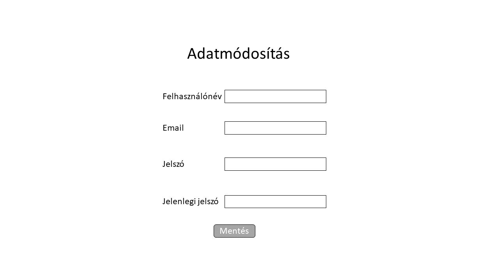
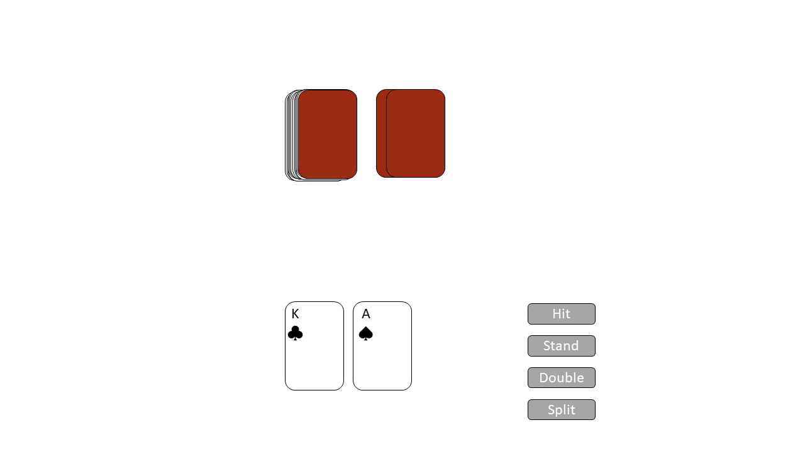

# Funkcionális specifikáció

## 1. Bevezetés

A csoport tagjai gyakran szoktat játszani a világhírű 'Huszonegy' nevezetű játékkal (angolul Blackjack),
így úgy gondoltuk, hogy ez egy megfelelő ötlet lenne a projektnek.
A játékhoz tartozni fog egy szabályrendszer ahonnan az is meg tudja tanulni a játék alapjait aki soha életében nem játszott huszoneggyet.
A játékban a játékos legnagyobb képessége a valószínűségszámítás lesz, így amelyik játékosnak jobb matematika tudása van, nagyobb eséllyel nyer.
A játékos a gép és később más játékos ellen is megméretettheti a kártyajátékban szerzett tapasztalatait.
A játékot webes felületen fogjuk elkészíteni, regisztráció és belépés után játszhatunk is a játékkal.

## 2. Jelenlegi helyzet

A megrendelő egy szimpla kártyajátékot szeretne, amin egyszerűen és gyorsan tud a nemzetközi szabályok szerint játszani, így a blackjack-re jutott a választás.
Az említett alkalmazást a megrendelő webes felületen szeretné használni, regisztrációval és belépést követően.
Az ügyfél ragaszkodott egy egyszerű de mindent átfogó szabályzati oldalhoz, ahol aki nem ért a játékhoz, megtudja tanulni az alapokat.
Jelenleg a program létrehozásához, elkészítéséhez szükséges adatokat, tevékenységeket egyeztetjük.

## 3. Vágyálom rendszer

A csoport célja egy valósággal megegyező Blackjacket létrehozni , melynek alapszabálya ,
hogy a játékmenet során a játékosnál lévő lapok összértéke több legyen az osztó lapjainak összértékénél, anélkül, hogy meghaladná a 21-et.
Az "asztaloknál" egyértelműen látható, hogy mekkora a minimális és a maximális tét, mely a játékos által felrakható.
A játék kezdetén a játékosok beteszik a tétjüket az úgynevezett fogadó zónájukba , és aki nyer , az nyeri az összes tétet.

## 4. Feltételek

Az alkalmazásunk létrehozásának alapfeltétele, a JavaScript , vagy valamilyen más programozási nyelv.
SQL adatbázis, ahol elmentjük a regisztrált adatokat és a zsetonok számát.

## 5. Jelenlegi üzleti folyamatok modellje

A mai világban a legtöbb embernek nincs elegendő pénzbeli háttere ahhoz, hogy egy élvezhető, szerencsén alapuló, könnyen kezelhető alkalmi játékkal játsszon, anélkül hogy ki kellene mozdulnia az illető komfortzónájából, bár van egy csomó online felületen elérhető ”szerencsejáték”- okkal foglalkozó weboldal,
ezeknek a hátránya:
- Bonyolult regisztráció
- Személyazonosság kiadása
- Bankkártya használata
Ezért arra jutottunk, hogy egy ingyenes, könnyű regisztrációs , szerencsén alapuló alkalmi játékot létrehozzunk.

## 6. Igényelt üzleti folyamatok modellje

Ezt a programot azért hozzuk létre, hogy a (szerencsejátékot szerető) emberek a szabad időjükben tudjanak játszani költségvetés, és személyi adatok kiadása nélkül. A projektünk egy adatbázissal lesz kapcsolatban, mely lokális módon lesz majd elérhető, egy adott hálózaton keresztül.
A könnyű regisztrációs előnynek köszönhetően, percek alatt már a játék felületet tudjuk kezelni, a zsetonok száma mentésre kerül, ez által nem kell minden alkalommal újból és újból az elejétől kezdeni a játékot, ennek köszönhetően a felhasználók nagyobb kedvvel fogják alkalmazni a program adta lehetőségeket.

## 7. Használati esetek

A Játékos az alábbi tevékenységeket végezheti:
- Regisztrálhat és törölhet fiókokat
- Öt percenként ingyen 25 zsetont kérhet
- Megtekintheti a zsetonjai számát
- Játék felületen, az ”osztótól” géptől lapot kérhet
- Abbahagyhatja a lapkérést
- Megtekintheti az aktuális játék eredményét a képernyőn megjelenő "Nyertél xy zsetont!", "Vesztettél xy zsetont!"
- Lehetősége van eldobni a kártyáit
- A játékot bármely pillanatban abbahagyhatja az oldal bezárásával, ilyenkor automatikusan kilép a bejelentkezett fiókból, a bejelentkezetett fiók zsetonjainak száma mentődik.
- Lehetősége van játék közben használni a súgót, mely megjeleníti melyik lap, mennyi pontot ér.
- Két kártyás huszonegy (blackjack) esetén a feltett tét háromszorosát nyeri a játékos.

## 8. Képernyőtervek

Fontosabb képernyők:
- regisztráció / bejelentkezés

- adatmódosítás

- játék

## 9. Forgatókönyvek

### Játékmenet forgatókönyve
Szereplők: Webalkalmazás

Bejelentkezve lehet játékot indítani. A játékos tétet választ, majd az osztó és a játékos is 2-2 lapot kap.

A játékos 3 lépés közül választhat:
- **Hit** (lapkérés): az osztó 1 új lapot ad a játékosnak. Ismételhető.
- **Stand** (megállás): a játékos nem húz több lapot.
- **Double** (tét emelés): a korábbi tétet megkétszerezi.

Ha a játékos végzett, az osztó lapjait felfedve meghatározzuk a kör nyertesét.
Ha a játékos nyert, a tét értéke hozzáadódik zsetonjai számához, ellenkező esetben levonódik belőle.
Ha elfogytak a zsetonjai, a játék véget ér.
